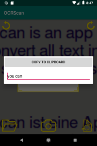

<h1>OCRScan</h1>
Deutsch weiter unten! 

 

 

This is an app to scan images of text with OCR (Optical Character Recognition). 
You can build the app with AndroidStudio or find the APK in the app folder. 
 
 
<h1>OCRScan</h1>

 

 

Dies ist eine App zum Scannen von Bildern mit Text mittels OCR (Optical Character Recognition). 
Sie können die App mit AndroidStudio übersetzen, oder aber die APK im app-Ordner finden. 
